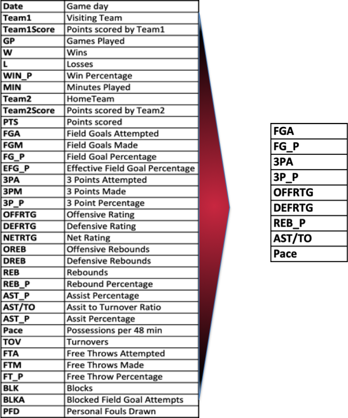

<b><font size="6"> NBA Game Predictor using ML Classifiers</font></b>


# Introduction & Objectives

This project was done with the goal of testing different Machine Learning (ML) Classification algorithms to predict NBA game winners. Because classifier algorithms were used, the predictions are whether a team A wins (1) or losses (0) the game, and to make it easier the team A will be the home team. 

NBA is one of the most popular sports league in the world and predicting game results is of interest to many followers/fans. In order to try to make this as accurate as possible with the tools available at this point, as many ML Classifiers as possible will be tested and compared/calibrated to the ground truth which will be the real life results. To make this happen, tests will be done using a 1 season database (2018-2019), and if results are accurate enough, then two larger data sets will be used: 10 years (2010-2020) and 20 years (2000-2020).

The previous NBA season (2018-2019) was chosen as the test data because when this project started, the 2019-2020 was still ongoing. However, as you will later read, this was added to the final tests and was used to predict the on-going playoff with great success.

The workflow used during this project follows the typical procedures/steps of an ML (Machine Learning) project:

* Pre-evaluation

* Data Gathering

* Data Cleaning and Conditioning

* EDA (Exploratory Data Analysis)

* Model(s) selection and Training

* Evaluating the Model(s)

* Final Modeling

* Post-Evaluation of the Model

With no further ado, let's expand on each one of these steps:

# Pre-Evaluation

This first step consists on the evaluation of the project idea and confirming if enough data is available for later training and testing. 

This idea is quite simple to explain: given an NBA season (2018-2019), I will use the game results to engineer a new stats column which will be whether the Home Team wins (1) or losses the game (0). The visiting team will be called Team1 and the Home team Team2, so from now onwards, I will use this nomenclature. 

In terms of data, there are close to 70 years of ABA (before it got rename to NBA) and NBA data that can be scrapped or simply downloaded from the web. So data will not be an issue, the real problem will be how many years should I use? because too many years doesn't make sense as the teams will be completely different today to what they were 20 or 30 years ago. Therefore tests will be needed to answer the length of the input dataset.

Then the second problem comes into place. There are close to 100, if not more, different stats that can be use, from the most simple to some complex ones. So, how many and which of these should I be concentrating on? I can't test them all, so this needs to be addressed. 

We now know that this is a doable project and will just need quite a bit of data scrapping and probably coming up with our own database which should be model ready. 

# Data Gathering

Gathering the data is not an easy task if you want to get the most recent and accurate stats, and if you want to have it relatively clean. Even when there are plenty of free sources to play with, I decided to create a completely new database taken bits and pieces from many and use only the last 20 NBA seasons (from 2000 until 2020) for the predictions, and 30 (1990 to 2020) to study the game's evolution and understand if there was any particular stat that would translate into a win.

The sites I took my data from are the following:

* https://stats.nba.com/teams/

* https://www.espn.co.uk/nba/stats/_/view/team

* https://www.basketball-reference.com

* https://watchstadium.com

* https://www.si.com

* https://www.basketball-reference.com/

Because the main objective of this project was to predict game results, I had to come up with a combination of statistics that would translate into wins. Now, for those who like basketball, you know that there are probably close to a hundred stats to play with, some are pure stats such as PPG (points per game), FG% (Field Goal Percentage), or 3PM (3-points made), and others are engineered, such as the players PER (Player Efficiency Rating), or for teams AST/TO (Assist to Turnover Ratio), or even a bit more advance like the EST.TOV% EST.PACE (Estimated Pace), so in order to come up with a good enough combination I needed to look into a few of them, read about them, and then shortlist them to start testing algorithms that would ultimately filter them.

According to NBA Analysts (stats.nba.com) some of the most relevant statistics that translate into wins are the following 9:

* Offensive Rating: estimated number of points a team scores per 100 possessions (higher is better)

* Defensive Rating: estimated number of points a team gives up per 100 possessions (lower is better)

* Field Goal Percentage

* Field Goal Attempts

* 3-point Percentage

* 3-point Attempts

* Assist/Turnover Ratio

* Rebound Differential

* Pace: estimated number of possessions per 48 minutes

If you would like to read more about any of these, you can refer to the link below, where you will find some of the easiest to understand explanations:

https://watchstadium.com/which-nba-statistics-actually-translate-to-wins-07-13-2019/

when you start digging for these statistics you will find out that some of them belong to the "General or Traditional Stats", some others to the "Advanced Stats", and the rest to what is called the "Four Factors", which talks about efficiency in percentages. 

In order to gathered all this data, I had to scrape some of the sites listed above, download some monthly stats as Excel files, and also manually type some of the missing values. For the scrapping, I used a Python package called Selenium. The link is below if by any chance you want to use it. It's quite easy and fast and doesn't involve any complex coding skills: 

* https://selenium-python.readthedocs.io/

# Data Cleaning and Conditioning

As mentioned above I created my own datasets by scrapping, downloading and manually filling the data for missing values for 1 season (2018-2019), 10 seasons (2010-2020) and 20 seasons (2000-2020). 

This is an interesting dataset with plenty of stats to explore (approximately 50) and for those not familiar with NBA basketball, an NBA Regular Season consists of 82 games per team that are played within the course of 7 months (from October until April). So to have an idea of the size of the final DataFrame, multiply 82 games * 30 Teams * 20 years and divide it by 2 as games are between two teams. That results in almost 25000 rows with 50 columns of Stats.

For details on the cleaning and the conditioning that all this data went through, please refer to the following two documents:

1. 2018-2019_Subset_Data_Cleaning

2. 2000-2020_Data_Cleaning_Conditioning

With all the cleaning and conditioning done I ended up with the following three DataFrames:


<b>Figure_2</b>: Game Result DataFrame with engineered "Game_Result" column which will be the Target for the Models


<b>Figure_3</b>: Average Generic Monthly Stats per team


<b>Figure_4</b>: Average Advanced Monthly Stats per team


<b>Figure_5</b>: Final DataFrame with "Game_Result" and monthly Average Generic and Advanced Stats assigned per team for Team1 and Team2. This is the Ready to Model DataFrame 

Figure 5 was the input for the 10 year models, but on top of these DataFrames, secondary ones were created for 2010-2020 and 2018-2019, plus, 30 smaller ones, one for each team were also created but only for the 10 seasons (2010-2020). So quite a bit of data when you think about it.

# Exploratory Data Analysis

The main goal/objective of this project was to predict the home team winning or losing games, but also, I had a secondary objective which was necessary to full-fill the first one and that one was of understanding the game's evolution. By trying to do so, I might be able to get hints of which statistical values are the most representative in terms on win shares, and maybe come up with a combination that would translate as wins. 

For this second study I used a smaller database that consists of the most relevant average stats per year for the last 30 years for all the teams together. I then plotted most of them with a fix 'Season' on the x-axis and the stat to study on the y-axis. You can see a few of them on Figure_6, 7 and 8, and if you interested on seeing the rest of them, you refer to the 2000-2020_EDA notebook on this repository.


<b>Figure_6</b>: This first pair shows the Age (above) and the weight (below) plotted against Seasons (year).What these two tell us is no surprise. With time, players are joining the NBA at a younger age, with many even straight from highshool. After seeing the success that some big name players have had at 18 or younger, this open a lot of opportunities to many others since teams are willing to take the risk, if they believe the talent and maturity is there. Some good examples are Kevin Garnett, Kobe Bryant, and Lebron James among others. Of course there is also a long list of low-impact players coming from highschool, but it's a chance that players and teams are taking more and more. 

The second plot was expected as well. With all the advances that the fitness industry has had in the past 30 years, you can see athletes becoming stronger, faster and more athletic in general. This is clearly seen in the NBA when you compare players from 20 years ago and 10 years ago with today's players. However, this doesn't translate as more physicality, on the contrary, the NBA rules have change quite a lot since then, allowing now considerably less contact than before and up to a certain degree losing up their defensive efforts.


<b>Figure_7</b>: Upper plot shows the Rebounds per game, and the lower the points per game scored. 

Figure_7 shows on the top plot the average rebounds per game. This is some how a surprise as I wasn't expecting the number of rebounds to have increased. Then when I looked at other plots, I got some hints that this could be due to the game having a faster pace. A faster pace would mean more shots per game, and without changing the field goal percentage, it will result in more rebounds per game right away. Then again, it could also mean that that the field goal percentage has dropped. When I looked at the field goal percentage of the past 30 years, yes it has dropped, but by a 2%, so not significant enough to produce such an increase of rebounds, so it has to be that the game is faster and therefore players get to shoot more and by almost keeping the same field goal percentage, scoring has to have increased as well, which is something that we clearly see on the lower plot. Today, teams are scoring an average of 5 more points peer game compared to 1990. There has been a drastic drop though as you can see in the middle of the plot, so the defense has been relaxing more and more with the years, or at least this is what that plot suggests.


<b>Figure_8</b>: Two of the best team and players defensive indicator, steals and blocks per game. Upper plot is the steals whereas the lower is the shot blocks.

These last two plots on Figure_8 are key for the interpretation of the defensive efforts. Steals and blocks per game are direct indicators of the team's and player's defense and as you can see from both plot, the numbers are dropping, hence the interpretation given by almost every NBA analyst today that team's need defense to win, however, it has lost relevance compare to the offense. We have reached the point where some coaches have the mentality that a good defense can be broken with a great offense, and that they can outscore the good defensive teams. that is not entirely wrong and very good offensive teams have done quite well in terms of win shares, however, none well enough to win a championship. In this study that is not the ultimate goal but to guess the winning team per game, therefore these are good observations/suggestions to which stats we should be looking at now that we know that defense plays a very important role to win a championship, but for a single game, a devastating offense might be key. This takes us to the next Figure_9


<b>Figure_9</b>: Feature Importance comparison. On the left, the plot corresponds to data from 2000 until 2010, and on the right, from 2010 until 2020. These plots illustrate how the game has shifted it's approach from a defensive minded with a big weight on offense as well, to a more offensive minded game, where defense is important but not as much as defense. Keep in mind that this is the average of the 30 NBA teams. If we do the same exercise for the top 5 or 6 teams today, so lets say the Milwaukee Bucks, LA, Lakers, LA, Clippers, Toronto Raptos and Boston for example, what they all have in common is a very tight defense with a good offense. So following that offensive trends translates into wins, but not into championships. The best example for this is the Houston Rockets. This team has one of the best offense in the game today, but so far they have not been able to win a championship with that strategy.  



<b>Figure_10</b>: On the left, the list of stats that have been analyzed, tested and modeled, and on the right side what resulted as the shortlisted stats. These stats match with what was mentioned earlier as the list described by NBA Analysts: https://watchstadium.com/which-nba-statistics-actually-translate-to-wins-07-13-2019/

With all the previous analysis done, including the one not described here but present on the EDA notebook, I analyzed the stats listed on the left longer column on Figure_10, and shortlisted 9 stats which offer a good balance and represent today's game. These stats will hopefully translate into wins, but remember that not necessarily into championship. In order to predict the champion I believe there is more to add to these models. what exactly? I will go into that on the way-forward and the bottom of this document. And, why didn't I go that route? mainly because of time as I had only one week to do this project.

# Model(s) Selection & Training

I mentioned at the beginning that I was going to test as many ML algorithms as possible in order to come up with the one that best fitted the project's objective. So thats exactly what I did. Below I have listed all the ML algorithms and on Figure 11 there is a summary which I will go over to let you understand what it means. 

Algorithms tested:

* Logistic Regression Classification

* KNN Classification

* Bagged Trees

* Random Forest

* SVM Linear Classification

* SVC Prediction

* Bagging SVC Ensemble Classifier

* AdaBoost Classfier

* XGBoost Classification

Remember, that for the modeling I used three different dataset. A first one which consists of 2018-2019 stats only, a second with the same stats but from 2010-2020, and a third from 2000 to 2020 with the same stats. Then when done I chose the ones I believed were the most appropriate and selected two teams to test my predictions and used a ground truth to compared the results. 


<b>Figure_11</b>: Summary of models tested results using the three datasets. In the orange cells, I have highlighted the model used for the latest real time predictions (Figure_14), and in yellow the model with the best results. 

These first set of tests were done with inputs from all the team together, the reason for this was to compare it with the NBA reported prediction accuracy which you can see in the middle as 75%. This means that in 75% of the games, they predicted that the Home Court Advantage was defended and as a result the home team (Tam2) won thee game. As you see using 1 year of data, meaning the previous season is always slightly below their predictions with the exception of the Logistic Regression which ended up with 76.85%, so with an over-estimation or probably it was just over-fitted. The results with the 10 years of data were the best ones, with some particular exception (Decision Tree), the rest were all quite close to the NBA predictions. Then if wee look at 20 years of data, the results are not bad, but I believe that this is not a great option as the teams are literarily not the same. Some of the owners have changed, some of the teams or home court have changed, players have retired, the NBA rules have completely changed, and many other factors have changed that don't make these stats the best to predict the results of today's game. However, as you can see, somehow the accuracy aren't bad at all. Still, out of these three samples I decided to keep the 10 years for the real time predictions. With this said, let's see what the model evaluations game as results and how we went to evaluating them


# Evaluating the Model(s)

To evaluate these results, two teams were randomly selected. One of the teams is the San Antonio Spurs, which is one of the most successful franchises of the past 20 years or so. They have won 5 championships within that time frame: 1999, 2003, 2005, 2007, and 2014, plus they have made the playoff in over 95% of the seasons. Their time is over now though as they just entered a rebuilding process due to many player's retirements (see Figure_12 for predictive modeling results). The second team is the Miami Heat. This franchise has not been as successful. They have won 3 titles in the same time frame: 2006, 2012, and 2013, but they have gone through a series of rebuilding processes and have gain and lost very high profile players such as Lebron James, Chris Bosh and Dwyane Wade, so this is a tier 2 team compare to the tier 1 that San Antonio is. The results of all of the predictive models for the Miami Heat can be seen on Figure_13.


<b>Figure_12</b>: Modeling Results for the San Antonio Spurs


In this tables, in the light green is what I called the "True" or the ground true. These are the real percentages/margins of wins for the home team (Team2). On the top there is the description of the data use, this would be the 1, 10, and 20 years, with their respective accuracy values below. 

Now I mentioned above that I chose to keep the 10 year data for the final predictions, but I'm sure you will be able to spot the KNN Classification of 100% accuracy. This is an unrealistic value, the reason why it happened is because of the small sample (11), so if you look at the predictions and the True values (see below) you will see that it is true that 100% of the predictions are real, but most probably once you increase this value, this will change. So it is simply because the test size (0.25) is too small and therefore the predictions are quit easy for this algorithm. But in reality that number will be higher and then more prone to errors. The rest of the other predictions are within acceptable range but not as good as the 10 year dataset.

True: [1 0 0 1 0 1 1 1 0 1 0]

Predicted: [1 1 0 1 1 1 1 1 1 1 1]


<b>Figure_13</b>: Modeling Results for the Miami Heat

This is the same exercise done for the Miami Heat. You can see that the NBA predicted 69% and the real value has been 68.7% so extremely accurate for them. Once again, the 20 years doesn't seem to be the best input but the results aren't bad. 


<b>Figure_14</b>: Real Time Prediction Results (update as the games progressed)

This takes us to the real time test. By the time this work was done the first game listed on Figure_14 had not happened yet, so it is from that point onwards that the predictions start to be properly evaluated. Surprisingly the accuracy is very high, and a lot higher that I was expecting. Now I won't lie and these are games that without an algorithm I could have predicted, and probably even with slightly more accuracy, but I would have no predicted the Boston Celtic beating the 76ers on their last match if they have had Ben Simmons on their team, but due to injuries he wasn't available, resulting in a dramatic change for these matchup. 

After the season ended I finished updating the game results based on the algorithm's prediction and once again, surprisingly it predicted the champion team. I personally thought this was a year for Los Angeles Clippers due to them being the deepest team in the league, but against all odds, and after being 3 games up to 1 in an 4 best series, they were defeated by the Denver Nuggets. A lot of the upset that happened have been justified by the fact that the season was resumed in a bubble. This bubble created a lot of stress on players and due to the lack of an audience in the games, it took away the home court advantage, therefore it would be interesting to see how these models would perform under normal circumstances. The 2020-2021 season will have limited if any spectators at all, so maybe waiting until thee 2021-2022 would be the best way to test the real performance of these ML models. 

Figure 15 and 16 corresponds to the predictions for the conference finals and the NBA finals. You will notice that the predictions were not bad at all, specially considering that this is not using all the external factors that could alter the game results.


<b>Figure_15</b>: Conference Finals Prediction results


<b>Figure_16</b>: NBA Finals Predictions

# Way Forward

As a basketball fan that has been following the game for over 30 years now, I know that using 20 years of data to predict games today is without a doubt not a good decision, in fact 10 years, even with the accuracy results that I got, is not the best either. On the contrary, 1 year is not enough. Why? because the NBA is a business driven league, and in today's economic environment some of the owners can manage to put together a set of start or superstars to make a run of winning a championship right away. So this is a big question for me today: how many years is ideal to account for these fast changes happening in the NBA and make the most accurate predictions possible? with this said, I would continue this project after handling my results to my Cohort and will update it with not only 2, 3, 4 and 5 year predictions, but also will add players stats that can add to a win or a lost game. Below are the steps that I will do in the coming months, hopefully before the 2020-2021 season start:

* Run models using 2, 3, 4 and 5 year data and compare them, but not only among themselves, but with the 1 and 10 years that I have already done. For this I will also add a new engineer data which will be how well a team does again each of the other 29 teams when playing at home. That should have a very strong weights on the predictions

* Run in parallel predictive models using player stats and not only team stats.

* Find a way to account for playoff experience and increase/decrease in performances under pressure, meaning in the playoffs

# Summary

Predicting sport results is always a fun task to do, but it is a lot more complicated that it seems as adding all the variables that can affect a games results, or a team/player performance is complicated. Many of the decisive stats need to be engineer and mainly this project has accounted for those that are the general and advance stats. 

With all the tests done that have pointed to all of the limitations that I have pointed out, i can still say with confidence, and of course by looking at the results that the classification algorithms work to a very high degree of accuracy, or at least that is what I have seen so far with a 86.36% of matches accurately predicted. 

One of the strongest limitations of these model that I have seen is the lack of accountability to injuries. Two matches that I would have predicted that the 76ers would have won as they had Home Court Advantage, and they preform extremely well during the Regular Season at home, they lost, why? most probably due to injuries. I respected the model's prediction even when I knew that it was almost impossible for the 76ers to win, but I thought it was the right thing to do to show the reader the limitations of the models.

Thee last thing that I would like to comment on, is that by reading so much about basketball statistics and game result predictions, I found out that most of the time analysts don't base their predictions on just one model, but on a set of models and then they come up with their interpretations. So this is something to keep in mind for future work. Maybe selecting more than one model for the predictions is better than relying on just one (?).

# Notebook breakdown

The following is a list of the Notebooks available on this repository with a description of what each contains:

* <b>2018-2019_Subset_Data_Cleaning</b>: Cleaning done on the 1 year/season dataset (2018-2019) to be used as thee input for the test of the models and see if the predictions are realistic or not. On this notebook, right at the bottom of it there is an additional section called "Bonus Material" which corresponds to tests done on three different teams. The tests are using the KNN Algorithm to predict the results of one season games on three teams:  The Golden State Warrior, the Milwaukee Bucks and the Brooklin Nets. 


* <b>2000-2020_Data_Cleaning_Conditioning</b>: This document contains all the cleaning and conditioning steps for two main datasets: 2000-2010 and 2010-2020 seasons. From here subsets for the teams used to test the algorithms were created. Any question about the manipulation done to the data, or where the data comes from, or anything about the engineer data, is available on this notebook


* <b>2000-2020_EDA</b>: This notebook is dedicated exclusively to the Exploratory Data Analysis done on the dataset thta contains the average of a series of stats per year. You will find detail explanations of how the NBA game has evolved during the past 30 years


* <b>2000-2020_LogisticRegression</b>: Document dedicated exclusively to the Logistic Regression and results evaluation on the three datasets and on individual teams


* <b>2000-2020_KNN_Classification</b>: Document dedicated exclusively to the KNN Classification and results evaluation on the three datasets and on individual teams


* <b>2000-2020_Decision_Tree_Classifier</b>: Document dedicated exclusively to the Decision Trees and results evaluation on the three datasets and on individual teams. Examples of Decision Tress plotted are found here. Some a bit large to understand so if needed they will have to be blown up to further read details


* <b>2000-2020_RandomForest</b>: Document dedicated exclusively to the Random Forest Classification and results evaluation on the three datasets and on individual teams. Several Tress have been selected here for evaluation so you can find the plots here


* <b>2000-2020_Other_Ensemble</b>: This document has other models that required less space and could be combined into one single document. The models are:


    * SVM Linear Classifier
    
    * SVC Prediction
    
    * Bagging SVC Ensemble
    
    * AdaBoost Classifier
    
    * XGBoost Classifier
    
On this document only the 2010-2020 dataset was used for testing as it had been already chosen as the more adequate dataset from the ones available.


```python

```
